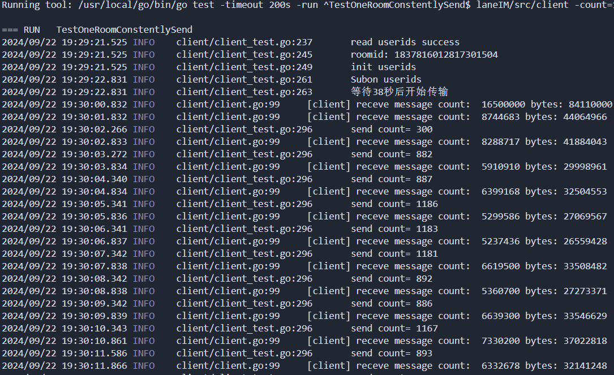
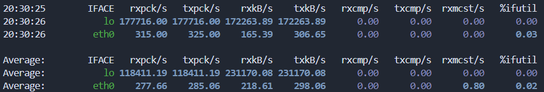

# discord 大群组高并发分布式 IM

以 discord 万人群组为目标设计，架构设计参考 bilibili 开源 goim，分为 comet（网关），job（数据推送），logic（业务）三大模块，均为无状态节点，模块均可弹性集群部署；集群通讯使用 grpc+protobuf 和 kafka；

comet 网关采用 websocket 长连接，内存池优化消息结构体；logic 业务模块接收 comet 信息，负责消息存储/用户状态查询/网关查询/群成员变动等等；job 推送模块缓存网关信息，转发群消息至 comet；

redis 缓存用户状态，网关路由等信息；kafka 消息队列，解耦业务与网络 IO；laneEtcd 集群服务注册发现；

二级缓存设计，设置 bigcache 一级本地缓存，redis 二级远程缓存；canal 维持 redis 数据一致性；redis 的 sub/pub 维持本地缓存一致性；

sycllaDB 海量消息存储和高效分页拉取; zap+lumberjack 异步日志和日志轮转;singleflight 优化高并发读；请求合并+batch APi 优化高并发读写：以可控较少延迟为代价减少网络请求次数

用户订阅消息机制，对不关心的群聊只推送消息未读数，解决扩散读问题；

# 压测 1：

环境：两台笔记本的 WSL 虚拟机上分别运行一个 comet 实例，其余 job 和 logic 均分

压测 case：每个 comet 长连接 5000 个用户，总共一万个在线用户，加入同一个房间，并持续推送消息

| 项目            | 数据                                   |
| --------------- | -------------------------------------- |
| 类型            | 10000 人群推送                         |
| 推送内容        | "hello"                                |
| 持续推送数据量  | 1340 条/秒                             |
| 推送到达        | 1340 万/秒                             |
| 接收流量 (eth0) | 124 KB/s (server1) 218 KB/s (server2)  |
| 发送流量 (eth0) | 98 KB/s (server1) 298 KB/s (server2)   |
| 客户端接收流量  | 32.8MB/s (server1) 33.4 MB/s (server2) |
| 接收流量 (回环) | 185 MB/s (server1) 231 MB/s (server2)  |
| 发送流量 (回环) | 185 MB/s (server1) 231 MB/s (server2)  |

server1 中的客户端监控数据



server2 网卡统计数据



# 压测 2：

压测环境： 本地单机搭建集群，job，comet，logic 各一个

压测 case：在千人群中，单人发送 N 条消息，并等待所有成员收到所花费的时间

注意，由于是单客户端发送消息，因此并非真并发，每发送一条消息都要得到 comet 的 ack 响应后才能发送下一条，

在发送方发完最后一条消息后，才开始对其他客户端接收消息计时

| 单人发送消息数 | 总转发数 | 从发送消息到完全接收的总耗时 | 发送方平均每条消息 ACK 延迟 | 等发送后，其他客户端完全接收所有消息耗时 |
| -------------- | -------- | ---------------------------- | --------------------------- | ---------------------------------------- |
| 1              | 1000     | 191ms                        | 0.52ms                      | 190ms                                    |
| 36             | 3.6W     | 186ms                        | 0.28ms                      | 177ms                                    |
| 1424           | 142.4W   | 556ms                        | 0.31ms                      | 105ms                                    |
| 4.80W          | 4808.7W  | 16s                          | 0.33ms                      | 143ms                                    |
| 19.32W         | 19322.8W | 62s                          | 0.32ms                      | 152ms                                    |

从消息发送速度来看，单客户端 0.32ms 的消息发送速度是比较理想的，若换成多客户端并发发送，系统每秒处理的速度上线更高，由压测 1 可以看到系统上限在 1000W QPS 级别，压测 2 中则显示大概在 311 W QPS 级别

因为 batch Api 的存在，客户端的多次请求会被合并，系统的网络通讯次数并不会跟随请求数线性增长，对网络 IO 利用率是比较高的，可以看到即使是 2 亿级别的消息转发量，客户端接收耗时也不会随之增长。

# 项目依赖

- [laneEtcd](<(https://github.com/Oncelane/laneEtcd)>) (本人另一个项目，性能相当的 etcd 实现)
- gRpc
- protobuf
- mysql
- kafka
- canal
- redis
- scylla

# 编译

```sh
make all -i

# 也可以分别编译
make build-comet
make build-job
make build-logic
```

修改 makefile 中的集群数目

```sh
# Default number of clusters

# local Cluster
Ncomet ?= 2
Njob ?= 1
Nlogic ?= 1

# network Cluster
Ncometp ?= 1
Njobp ?= 1
Nlogicp ?= 1

```

# 启动：

首先要检查有无启动 kafka，canal，redis，laneEtcd（请查看[此项目地址](https://github.com/Oncelane/laneEtcd)）

本地集群方式（推荐）:

打开三个终端，分别运行三个命令以启动三个集群

logic 集群

```sh
make run-logic
```

comet 集群

```sh
make run-comet
```

job 集群

```sh
make run-job
```

canal 服务器是可选的，它可以用于保障 sql 和 redis 之间，以及 redis 和 localcache 之间的数据一致性，但是有一定的延迟

```sh
cd src/cmd/canal/
go run main.go
```

# 测试

```sh
# 进入src/cmd
cd src/client
# 使用vscode之类的ide手动运行测试项目即可
```

# 依赖安装

安装 protobuf grpc complier
sudo apt-get install protobuf-compiler

gRPC Go 插件

```sh
go install google.golang.org/protobuf/cmd/protoc-gen-go@latest
go install google.golang.org/grpc/cmd/protoc-gen-go-grpc@latest
```

# protoc 命令

```sh
protoc --go_out=.. --go-grpc_out=.. --go-grpc_opt=require_unimplemented_servers=false -I. -Iproto proto/msg/msg.proto proto/comet/comet.proto proto/logic/logic.proto
```

# scylla 集群

## 安装：

[官网网址](https://www.scylladb.com/download/?platform=ubuntu-20.04&version=scylla-6.1#open-source)

可能需要科学上网

init address

```sh
sudo mkdir -p /etc/apt/keyrings
sudo gpg --homedir /tmp --no-default-keyring --keyring /etc/apt/keyrings/scylladb.gpg --keyserver hkp://keyserver.ubuntu.com:80 --recv-keys 491c93b9de7496a7
```

```sh
sudo curl -L --output /etc/apt/sources.list.d/scylla.list https://downloads.scylladb.com/deb/ubuntu/scylla-6.1.list
```

Install packages

```sh
sudo apt-get update
sudo apt-get install -y scylla
```

Set Java to 1.8 release

```sh
sudo apt-get update
sudo apt-get install -y openjdk-8-jre-headless
sudo update-java-alternatives --jre-headless -s java-1.8.0-openjdk-amd64
```

## 配置:

setup

```sh
# scylla_setup accepts command line arguments as well! For easily provisioning in a similar environment than this, type:

    scylla_setup --no-raid-setup --online-discard 1 --nic eth0 \
                 --io-setup 1 --no-memory-setup --no-rsyslog-setup

# Also, to avoid the time-consuming I/O tuning you can add --no-io-setup and copy the contents of /etc/scylla.d/io*
# Only do that if you are moving the files into machines with the exact same hardware
```

config

```sh
sudo nano /etc/scylla/scylla.yaml

# cluster_name: 'laneIM'
```

set ScyllaDB to developer mode.

```sh
sudo scylla_dev_mode_setup --developer-mode 1
```

## 启动

```sh
sudo systemctl start scylla-server.service
```

check status

```sh
sudo systemctl status scylla-server.service
```

# redis 集群

## 搭建

启动六个单独节点

```sh
bash redisClusterStart.sh
```

组建集群

```sh
redis-cli --cluster create 127.0.0.1:7001 127.0.0.1:7002 127.0.0.1:7003 127.0.0.1:7004 127.0.0.1:7005 127.0.0.1:7006 --cluster-replicas 1
```

## 下次启动

```sh
# 启动
bash redisClusterStart.sh
# 关闭
bash redisClusterClose.sh
```

​ 执行 redis-cli -p 7001 进入客户端并通过 `info replication` 查看集群信息

通过`cluster nodes`查看集群关系

通过`cluster info`查看集群信息

查看所有 key

```bash

```

删除所有 kv

```bash

```

# kafka 客户端

客户端：confluent-kafka-go

下载 lib

```bash
git clone https://github.com/edenhill/librdkafka.git
cd librdkafka
```

安装

```bash
./configure --prefix /usr
make
sudo make install
```

配置

```bash
export PKG_CONFIG_PATH=/usr/lib/pkgconfig
```

# kafka 集群

确保 Kafka 版本支持 Kraft 模式（Kafka 2.8.0 及以上版本）

依赖 jdk11

```bash
export JAVA_HOME=/usr/local/java/jdk1.8.0_411
export JRE_HOME=${JAVA_HOME}/jre
export CLASSPATH=.:${JAVA_HOME}/lib:${JRE_HOME}/lib
export PATH=${JAVA_HOME}/bin:$PATH
```

下载

```sh
wget https://downloads.apache.org/kafka/3.7.1/kafka_2.12-3.7.1.tgz
tar -xzf kafka_2.13-3.0.0.tgz
cd kafka_2.13-3.0.0
```

编辑 server.properties 配置文件
在 config 目录下，打开 server.properties 文件，并添加或修改以下配置：

server.properties

```sh
   # Set the process roles to broker and controller
   process.roles=broker,controller

   # Specify the controller listener name
   controller.listener.names=CONTROLLER

   # Define listeners for broker and controller
   listeners=PLAINTEXT://localhost:9092,CONTROLLER://localhost:9093

   # Define inter-broker listener name
   inter.broker.listener.name=PLAINTEXT

   # Specify the log directory for metadata
   log.dirs=/tmp/kraft-combined-logs

   # Specify the metadata quorum
   controller.quorum.voters=0@localhost:9093

   # Cluster ID
   broker.id=0

   # Initial cluster ID (generate a new cluster ID if this is the first time you're starting this cluster)
   # You can generate a new cluster ID using the kafka-storage.sh tool
```

生成集群 ID
使用 Kafka 提供的工具 kafka-storage.sh 生成一个新的集群 ID，并格式化日志目录。

```sh
 bin/kafka-storage.sh random-uuid
```

将生成的 UUID 替换到以下命令中：

```sh
   bin/kafka-storage.sh format -t <生成的UUID> -c config/server.properties
```

二、启动 Kafka
启动 Kafka 服务器

```sh
   bin/kafka-server-start.sh config/server.properties
```

三、验证 Kafka 是否在 Kraft 模式下运行
检查日志
查看 Kafka 日志，确保没有错误，并且 Kafka 正确地启动了控制器和代理。
使用 Kafka 客户端
使用 Kafka 客户端来创建主题、生产和消费消息，确保 Kafka 正常运行。

```sh

   # 创建一个主题
   bin/kafka-topics.sh --create --topic test-topic --bootstrap-server localhost:9092 --partitions 1 --replication-factor 1

   # 生产消息
   bin/kafka-console-producer.sh --topic test-topic --bootstrap-server localhost:9092

   # 消费消息
   bin/kafka-console-consumer.sh --topic test-topic --from-beginning --bootstrap-server localhost:9092
```

# etcd 集群

goreman 工具

```sh
go install github.com/mattn/goreman@latest
goreman -f local-cluster-profile start
```

下载 etcd

```sh
wget https://github.com/etcd-io/etcd/releases/download/v3.5.15/etcd-v3.5.15-linux-amd64.tar.gz
cd etcd
./build.sh
nano ~/.bashrc
export PATH="$PATH:$GOPATH/src/github.com/etcd-io/etcd/bin"
source ~/.bashrc
```

列出所有键：
使用 etcdctl 列出所有键：

```bash
etcdctl get "" --prefix --keys-only
```

删除所有键：
使用 etcdctl del 命令删除所有键：

```bash
etcdctl del "" --prefix
--prefix 选项会删除以指定前缀开头的所有键。由于指定了空字符串 "" 作为前缀，这会删除所有键。
```

# mysql 安装

```bash
sudo apt update
sudo apt install mysql-server
# 查看密码
sudo cat /etc/mysql/debian.cnf
```

# mysql 建库

```bash
# 创建数据库laneIM
# 先启动logic会自动建表
```

# canal 安装

```bash
sudo mkdir -p /opt/canal
sudo chmod 777 /opt/canal && cd /opt/canal
wget https://github.com/alibaba/canal/releases/download/canal-1.1.7/canal.deployer-1.1.7.tar.gz
tar -zxvf canal.deployer-1.1.7.tar.gz
```

# canal 配置

```bash
mkdir -p conf/laneIM
cp conf/example/instance.properties conf/laneIM/

```

```sh
nano conf/canal.properties
#################################################
#########               destinations            #############
#################################################
canal.destinations = laneIM
```

```sh
nano conf/laneIM/instance.properties
#################################################
## mysql serverId , v1.0.26+ will autoGen
# canal.instance.mysql.slaveId=0

# enable gtid use true/false
canal.instance.gtidon=false

# position info
canal.instance.master.address=127.0.0.1:3306
canal.instance.master.journal.name=
canal.instance.master.position=
canal.instance.master.timestamp=
canal.instance.master.gtid=

# rds oss binlog
canal.instance.rds.accesskey=
canal.instance.rds.secretkey=
canal.instance.rds.instanceId=

# table meta tsdb info
canal.instance.tsdb.enable=true
#canal.instance.tsdb.url=jdbc:mysql://127.0.0.1:3306/canal_tsdb
#canal.instance.tsdb.dbUsername=canal
#canal.instance.tsdb.dbPassword=canal

#canal.instance.standby.address =
#canal.instance.standby.journal.name =
#canal.instance.standby.position =
#canal.instance.standby.timestamp =
#canal.instance.standby.gtid=

# username/password
canal.instance.dbUsername=debian-sys-maint
canal.instance.dbPassword=FJho5xokpFqZygL5
# debian-sys-maint
# FJho5xokpFqZygL5
canal.instance.connectionCharset = UTF-8
# enable druid Decrypt database password
canal.instance.enableDruid=false
#canal.instance.pwdPublicKey=MFwwDQYJKoZIhvcNAQEBBQADSwAwSAJBALK4BUxdDltRRE5/zXpVEVPUgunvscYFtEip3pmLlhrWpacX7y7GCMo2/JM6LeHmiiNdH1FWgGCpUfircSwlWKUCAwEAAQ==

# table regex
canal.instance.filter.regex=.*\\..*
# table black regex
canal.instance.filter.black.regex=mysql\\.slave_.*
# table field filter(format: schema1.tableName1:field1/field2,schema2.tableName2:field1/field2)
#canal.instance.filter.field=test1.t_product:id/subject/keywords,test2.t_company:id/name/contact/ch
# table field black filter(format: schema1.tableName1:field1/field2,schema2.tableName2:field1/field2)
#canal.instance.filter.black.field=test1.t_product:subject/product_image,test2.t_company:id/name/contact/ch

# mq config
canal.mq.topic=laneIM
# dynamic topic route by schema or table regex
#canal.mq.dynamicTopic=mytest1.user,topic2:mytest2\\..*,.*\\..*
canal.mq.partition=0
# hash partition config
#canal.mq.enableDynamicQueuePartition=false
#canal.mq.partitionsNum=3
#canal.mq.dynamicTopicPartitionNum=test.*:4,mycanal:6
#canal.mq.partitionHash=test.table:id^name,.*\\..*
#
# multi stream for polardbx
canal.instance.multi.stream.on=false
#################################################
```

# canal 启动

```sh
bash bin/startup.sh
```

```sh
#设置RoomMgr信息：
HMSET room:{RoomID} OnlineCount 10
SADD room:{RoomID}:users_set {UserID}
SADD room:{RoomID}:comets_set {CometAddr}

# 设置UserMgr信息：
HMSET user:{UserID} CometAddr {CometAddr} Online true
SADD user:{UserID}:rooms_set {RoomID}

#设置CometMgr信息：
SADD comet:{CometAddr}:rooms_set {RoomID}
```

# next
